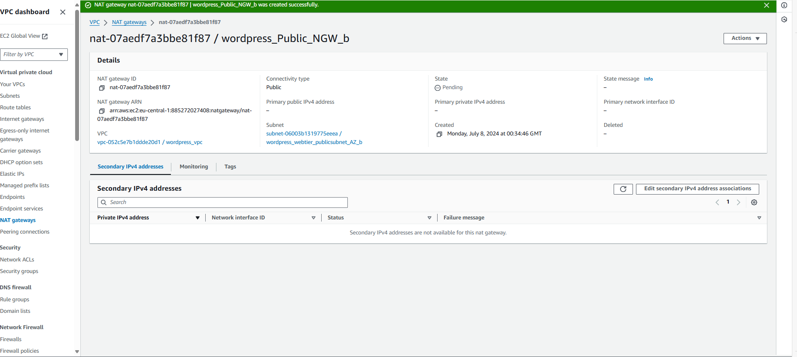

# BUILDING A HIGHLY AVAILABLE WEB APPLICATION

## Project Overview

As I embark on this exciting project, I will be creating a highly available, scalable deployment of the WordPress web application using AWS services. This project is particularly relevant given the need for web applications to continuously scale in response to varying request rates and achieve high availability. Ensuring an application can run from multiple locations and continue to function even if some components, servers, or locations fail, is critical.

## Objectives and Steps

1. **VPC Creation**:
   I will start by creating an Amazon Virtual Private Cloud (VPC) across multiple availability zones in my chosen region. This setup will form the backbone of my deployment, ensuring redundancy and high availability.

2. **Database Deployment**:
   Next, I will deploy a highly available relational database across the chosen availability zones using Amazon RDS. This step is crucial for maintaining data integrity and accessibility even if one availability zone fails.

3. **Application Tier Creation**:
   With the data tier in place, I will then focus on creating the application tier. By using Amazon Elastic File System (EFS), I will set up a shared file system that spans multiple availability zones. This shared file system will enable seamless scaling of the application servers.

4. **Web Server Configuration**:
   Finally, I will create a load-balanced group of web servers that automatically scale in response to the incoming load. This will complete the application tier, ensuring that the WordPress application can handle varying traffic levels efficiently.

## Learning and Implementation

These steps are based on the reference architecture for hosting WordPress on AWS, available on GitHub. Throughout this project, I will be working through a series of labs that will guide me in setting up this robust and scalable environment.

---

This project is a great opportunity for me to deepen my understanding of cloud infrastructure and scalability. I'm looking forward to implementing these concepts and seeing the WordPress application run smoothly, regardless of the load and potential failures.

### Configure the Network

#### Create a New Virtual Private Cloud (VPC)

As the first step in this project, I logged into my AWS account, chose the Europe (Frankfurt) region (`eu-central-1`), and began setting up a new VPC. This involved navigating to the "Your VPCs" section on the console and clicking "Create VPC." I named my VPC `wordpress_vpc` and assigned it a CIDR range of `192.168.0.0/24`. After completing these steps, I created the VPC.

Next, I accessed the VPC details page, clicked on "Actions," and selected "Edit VPC Settings." I ensured that both DNS resolution and DNS hostnames were enabled under DNS Settings and saved the changes.

#### Create Public and Private Subnets in the New VPC

With the VPC created, my next task was to set up the subnets. These subnets would host the application across two different Availability Zones (AZs). I planned to create a total of six subnets, three for each AZ.

The subnets were designed as follows:
- The first pair of subnets, labeled as "Public," would be accessible from the Internet and would contain load balancers and NAT gateways.
- The second pair, labeled as "Application," would contain the application servers and my shared EFS filesystem. These application servers would communicate with the Internet via the NAT gateways but would only be addressable from the load balancers.
- The final pair, labeled as "Database," would hold the active/passive relational database. These would be accessible to other resources in the VPC but would have no direct access to the Internet.

To create each of these six subnets, I navigated to the "Subnets" section on the left of the AWS VPC console, clicked "Create subnet," and entered the details as per the table below. I made sure to always select the `wordpress_vpc` when creating the subnets.

| Subnet Name                             | AZ                | CIDR Range           |
|-----------------------------------------|-------------------|----------------------|
| wordpress_webtier_publicsubnet_AZ_a     | eu-central-1a     | 192.168.0.0/27       |
| wordpress_webtier_publicsubnet_AZ_b     | eu-central-1b     | 192.168.0.32/27      |
| wordpress_apptier_privatesubnet_AZ_a    | eu-central-1a     | 192.168.0.64/27      |
| wordpress_apptier_privatesubnet_AZ_b    | eu-central-1b     | 192.168.0.96/27      |
| wordpress_DBtier_privatesubnet_AZ_a     | eu-central-1a     | 192.168.0.128/27     |
| wordpress_DBtier_privatesubnet_AZ_b     | eu-central-1b     | 192.168.0.160/27     |

After creating the subnets, I verified that they could route network traffic between them.

#### Create an Internet Gateway and Set Up Routing

The next step was to set up an Internet Gateway (IGW) for my VPC. From the VPC dashboard, I clicked on "Internet gateways," created a new IGW, named it `wordpress_IGW`, and attached it to `wordpress_vpc`.

With the IGW in place, I created a new route table  called `wordpress_Public_RT` and associated it with the public subnets. This involved creating the route table, adding a default route via the newly created Internet Gateway, and associating this route table with the two public subnets (`wordpress_webtier_publicsubnet_AZ_a` and `wordpress_webtier_publicsubnet_AZ_b`).

#### Create One NAT Gateway in Each Public Subnet

To ensure my WordPress instances could connect to the Internet and download updates, I created two NAT gateways, one for each Availability Zone. I went to the VPC dashboard, selected "NAT gateways," and created a NAT gateway in each of the two public subnets.

The two NAT gateways created were called `wordpress_Public_NGW_a` and `wordpress_Public_NGW_b`. These were associated with the subnets `wordpress_webtier_publicsubnet_AZ_a` and `wordpress_webtier_publicsubnet_AZ_b` respectively. During the creation process, I also added Elastic IP addresses to these NAT gateways.

To ensure my WordPress instances could connect to the Internet and download updates, I created two NAT gateways, one for each Availability Zone. I went to the VPC dashboard, selected "NAT gateways," and created a NAT gateway in each of the two public subnets.

The two NAT gateways created were called `wordpress_Public_NGW_a` and `wordpress_Public_NGW_b`. These were associated with the subnets `wordpress_webtier_publicsubnet_AZ_a` and `wordpress_webtier_publicsubnet_AZ_b` respectively. During the creation process, I also added Elastic IP addresses to these NAT gateways.

To ensure my WordPress instances could connect to the Internet and download updates, I created two NAT gateways, one for each Availability Zone. I went to the VPC dashboard, selected "NAT gateways," and created a NAT gateway in each of the two public subnets.

The two NAT gateways created were called `wordpress_Public_NGW_a` and `wordpress_Public_NGW_b`. These were associated with the subnets `wordpress_webtier_publicsubnet_AZ_a` and `wordpress_webtier_publicsubnet_AZ_b` respectively. During the creation process, I also added Elastic IP addresses to these NAT gateways.

An Elastic IP address is a static, public IPv4 address designed for dynamic cloud computing. By assigning an Elastic IP address to a NAT gateway, I ensured that the NAT gateway would have a consistent IP address, even if it was stopped and started. This is crucial for maintaining stable and reliable Internet connectivity for the resources within the private subnets.

The Elastic IP addresses allow the NAT gateways to facilitate outbound Internet traffic for instances in the private subnets while preventing direct inbound access from the Internet, thereby enhancing both connectivity and security. Essentially, the Elastic IP addresses ensure that the NAT gateways can reliably act as intermediaries for Internet-bound traffic. This setup allows instances in the private subnets to initiate outbound connections to the Internet, such as downloading updates or accessing external APIs, while blocking unsolicited inbound traffic. This configuration enhances the security posture of the VPC by ensuring that only desired and secure connections are established.

Next, I created route tables for each of the two application subnets, updating each route table with a default route through the corresponding NAT gateway. I then associated each route table with the respective application subnet.

The first route table was named `wordpress_Private_RTa`. This route table had its route pointing to the Internet through the NAT gateway `wordpress_Public_NGW_a` and also included a local route of `192.168.0.0/24`. This configuration ensured that all traffic destined for the Internet from the subnet would pass through the NAT gateway while allowing local traffic to be routed within the VPC. I associated this route table with the subnet `wordpress_apptier_privatesubnet_AZ_a`.

Routes Associated with the Route Table

Subnets Associated with the Routes

The second route table was named `wordpress_Private_RTb`. Similar to the first, this route table had its routes pointing to the Internet through the NAT gateway `wordpress_Public_NGW_b` and also included a local route of `192.168.0.0/24`. This ensured that outbound Internet traffic from the subnet would use the corresponding NAT gateway while allowing local routing within the VPC. I associated this route table with the subnet `wordpress_apptier_privatesubnet_AZ_b`.

Routes Associated with the Route Table

Subnets Associated with the Route

The configurations for both route tables can be visualized in the following image, which shows the route associations and subnet associations for `wordpress_Private_RTa` and `wordpress_Private_RTb`.

#### Verify Configuration

I now had a virtual private cloud network set up across two availability zones within the Europe (Frankfurt) region. The network included six subnets, three in each AZ, with appropriate routing configurations:
- Public subnets could communicate with the Internet.
- Application subnets could communicate with the Internet via NAT gateways.
- Data subnets were isolated from the Internet but could communicate with other resources within the VPC.

I verified my setup by checking the Resource map section of my VPC, which displayed the VPC, subnets, route tables, Internet gateways, and NAT gateways, allowing me to visualize the resources and their configurations.

With the network configuration verified, I was ready to move on to creating the database cluster.

<video controls src="NetorkSetUpVerification.mp4" title="NetworkVerification"></video>
## Building the Data Tier

Now that I have created a virtual network across multiple Availability Zones, I will create a resilient, highly-available data tier designed to support my WordPress installation.

In the next steps, I will:

1. Create an active/passive database deployment using Amazon Relational Database Service (RDS).
2. Create a shared filesystem using Amazon Elastic File System (EFS) to store WordPress content.

To begin, I will start by creating the database.

## Setting Up the RDS Database

### Create Database Security Groups

I created two security groups to secure the database:

- `wordpress_WebTier_SG` for the EC2 instances running the web servers
- `wordpress_DBTier_SG` for the RDS DB instance

I began by visiting the Amazon VPC console to create these security groups.

#### Creating the `wordpress_WebTier_SG` Security Group

First, I created the `wordpress_WebTier_SG` security group. I filled in the "Security group name" and "Description" fields and selected the `wordpress-workshop` VPC from the drop-down menu. After scrolling to the bottom of the page, I clicked "Create security group."

#### Creating the `wordpress_DBTier_SG` Security Group

Next, I created the `wordpress_DBTier_SG` security group. In the "Inbound Rules" section, I added a rule for MySQL/Aurora, allowing traffic on port 3306 from the custom source `wordpress_WebTier_SG` and its source set to the `wordpress_WebTier_SG` security group. I then finalized the creation by clicking "Create security group."

With these security groups in place, I ensured the necessary permissions for database client and server interactions were established.

### Create an RDS Subnet Group

Setting up Amazon RDS involved creating a subnet group that determines the subnets for database instance deployment. To do this, I navigated to the Amazon RDS console, selected "Subnet groups," and created a new subnet group with the following details:

- **Name:** `wordpress_SubnetGroup`
- **Description:** RDS subnet group used by WordPress
- **VPC:** `wordpress-workshop`

I added the two data subnets created earlier, `wordpress_DBtier_privatesubnet_AZ_a` and `wordpress_DBtier_privatesubnet_AZ_b`. This configuration allowed RDS to deploy the database instances across different availability zones, ensuring high availability and resilience.

### Create the Aurora Database Instance

With the subnet group ready, I proceeded to launch the RDS-managed database. I selected "Databases" from the Amazon RDS Console menu and clicked "Create database." Using the standard create method, I opted for Aurora (MySQL Compatible) as the engine.

For the master username, I used `noble_antwi`, and set the master password. I chose a burstable instance class (db.t4g.medium) for cost efficiency, noting that it might not be suitable for production environments. 

In the connectivity section, I made sure to select the `wordpress-workshop` VPC, the `wordpress_SubnetGroup`, and the `wordpress_DBTier_SG` security group. I disabled DevOps Guru in the Monitoring section and specified `wordpress_db` as the initial database name in the additional configuration section. Finally, I clicked "Create database" to initiate the cluster creation. The database took a few minutes to be provisioned and made available.

### Verify Your Configuration

At this stage, the active/passive database setup should be operational across two different availability zones, ready to accept connections from EC2 instances with the `wordpress_WebTier_SG` security group. I compared my configuration to ensure everything was set up correctly before proceeding.

### Next Steps

The next step involves adding a caching layer for common SQL requests to reduce the strain on the database and enhance the performance of the WordPress web application. This caching layer will store frequently requested data, minimizing unnecessary queries to the database.

With the database setup verified, I am now ready to deploy the database caching layer to optimize WordPress performance.
